# console-gen

`console-gen` turns console logs into PNG screenshots that look like real terminal windows. It is designed for laboratory reports, coursework, and technical documentation where pasted plain text looks too artificial.

## Features

- PNG output with transparent outer margins.
- Window frames for Windows Terminal, macOS Terminal, Ubuntu Terminal, and frameless terminal blocks.
- Automatic terminal theme selection with `--theme auto`.
- ANSI SGR support: real colorized command output is preserved when the input log contains escape codes.
- Logs without ANSI escape codes are rendered with the selected theme text color.
- Source code rendering with syntax highlighting for any language supported by Pygments.
- Syntax presets inspired by VS Code and IntelliJ IDEA.
- Built-in themes are stored as JSON resources and can be extended or overridden with custom JSON theme files.
- JSON render configs for reusable frame, typography, spacing, and syntax settings.
- Long logs are rendered as tall screenshots with automatic line wrapping.

## Examples

Frame examples:

| Windows | macOS |
| --- | --- |
| 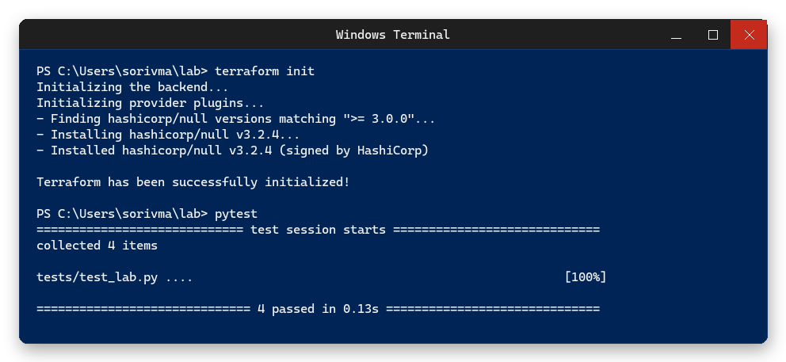 | 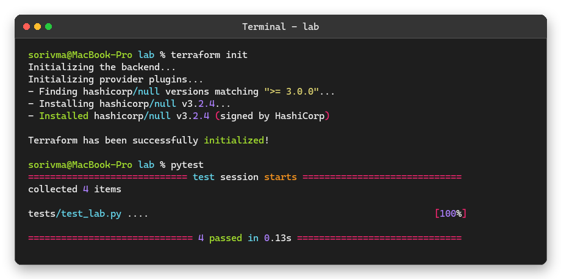 |

| Ubuntu | Frameless |
| --- | --- |
| 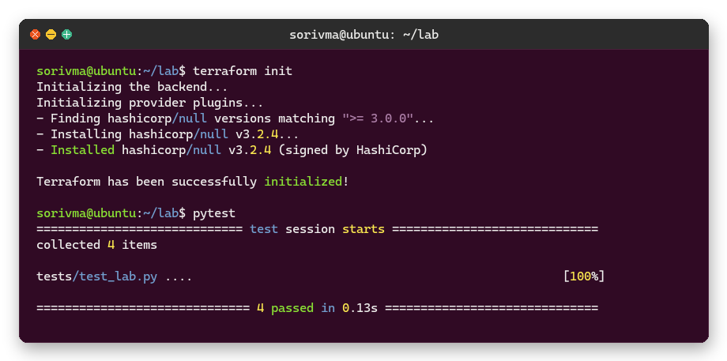 | 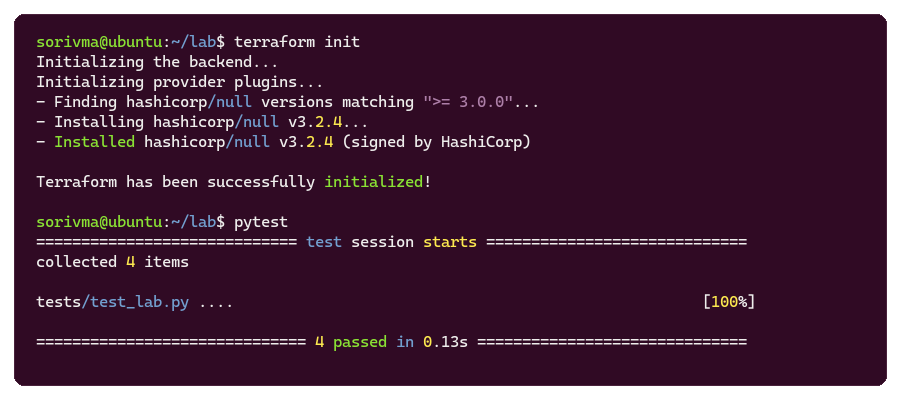 |

Code examples:

| Python | Vagrantfile | Ansible |
| --- | --- | --- |
|  |  |  |

Long output:

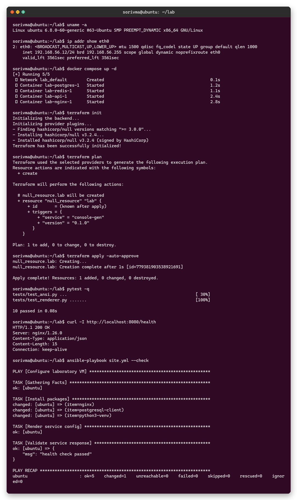

Code input examples:

```text
examples/example.py
examples/Vagrantfile
examples/ansible-playbook.yml
examples/code-render.json
```

## Installation

Install from a local checkout:

```powershell
pip install --user -e .
```

For development with tests:

```powershell
pip install --user -e .[dev]
```

After installation the command is available as:

```powershell
console-gen --help
```

## Usage

```powershell
console-gen render -i lab.log -o build/lab-console.png
```

Common options:

```powershell
console-gen render -i lab.log -o build/windows.png --frame windows
console-gen render -i lab.log -o build/macos.png --frame mac
console-gen render -i lab.log -o build/ubuntu.png --frame ubuntu
console-gen render -i lab.log -o build/block.png --frame frameless
console-gen render -i lab.log -o build/large.png --width 110 --font-size 16
```

Render syntax-highlighted code:

```powershell
console-gen render -i examples/example.py -o build/python-code.png --content-type code --language python --syntax-theme vscode-dark
console-gen render -i examples/Vagrantfile -o build/vagrantfile.png --content-type code --language ruby --syntax-theme intellij-dark
console-gen render -i examples/ansible-playbook.yml -o build/ansible.png --content-type code --language yaml --syntax-theme vscode-light
```

Language detection is enabled by default for code mode, using the input filename and content:

```powershell
console-gen render -i examples/ansible-playbook.yml -o build/ansible-auto.png --content-type code
```

List available built-in themes:

```powershell
console-gen themes
```

For repeatable output, use a JSON config:

```powershell
console-gen render -i examples/example.py -o build/python-config.png --config examples/code-render.json --language python
```

Config keys map to `RenderOptions` fields. Short aliases `width` and `theme` are also accepted:

```json
{
  "content_type": "code",
  "syntax_theme": "vscode-dark",
  "frame": "mac",
  "title": "Source Preview",
  "width_chars": 88,
  "font_size": 15,
  "line_spacing": 6,
  "padding_x": 24,
  "padding_y": 20,
  "radius": 12
}
```

Available frames:

```text
windows, mac, ubuntu, frameless
```

Available themes:

```text
auto, catppuccin-latte, catppuccin-mocha, dark, dracula, github-dark,
github-light, gruvbox-dark, gruvbox-light, light, macos, monokai, nord,
one-dark, powershell, rose-pine, solarized-dark, solarized-light,
tokyo-night, ubuntu
```

Available syntax themes:

```text
catppuccin-latte, catppuccin-mocha, dracula, github-dark, github-light,
gruvbox-dark, gruvbox-light, intellij-dark, intellij-light, monokai, nord,
one-dark, rose-pine, solarized-dark, solarized-light, tokyo-night,
vscode-dark, vscode-light
```

By default, `--theme auto` chooses colors from the selected frame. ANSI colors in the input log are preserved; plain text is not automatically highlighted.

## Built-in Theme Gallery

Terminal theme presets:

| Dark | Light | PowerShell |
| --- | --- | --- |
| 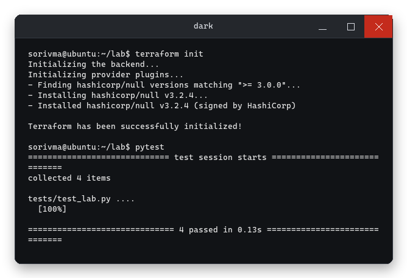 | 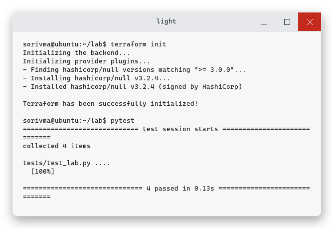 | 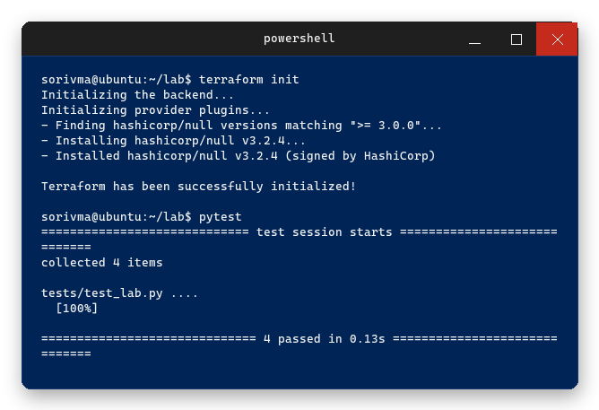 |

| Ubuntu | macOS | Dracula |
| --- | --- | --- |
| 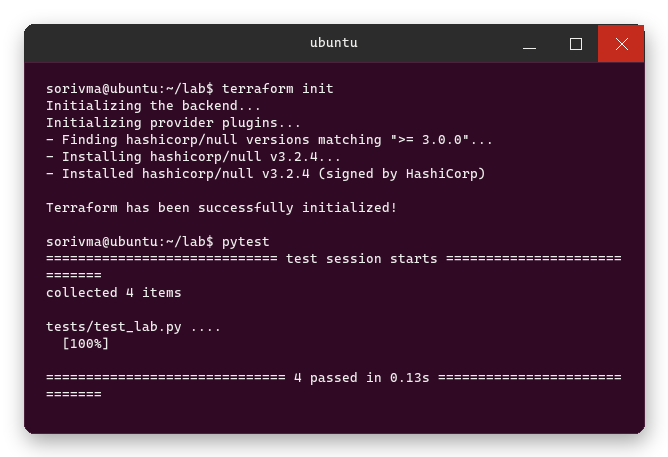 | 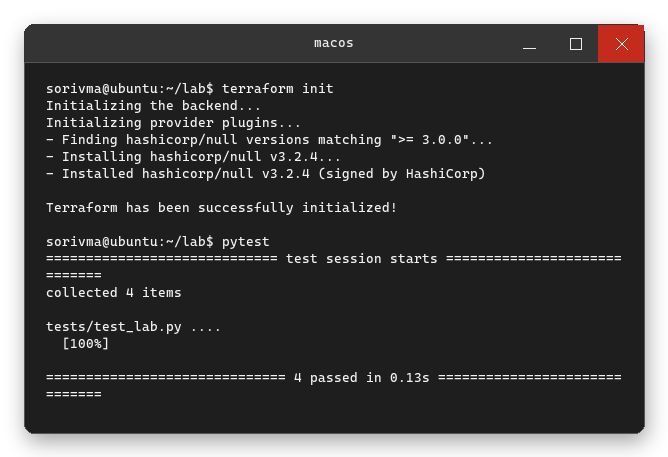 | 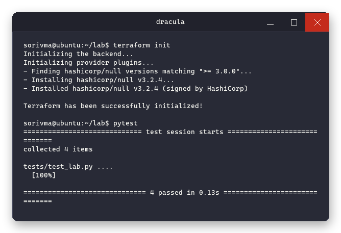 |

| Gruvbox Dark | Gruvbox Light | Nord |
| --- | --- | --- |
| 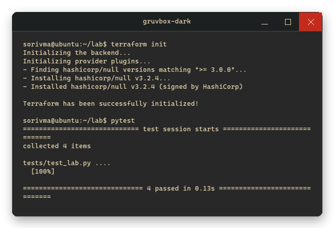 | 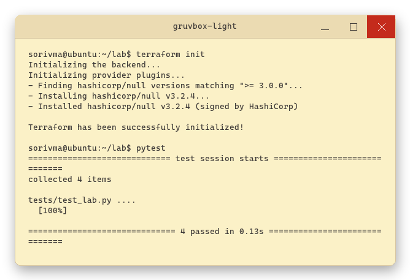 | 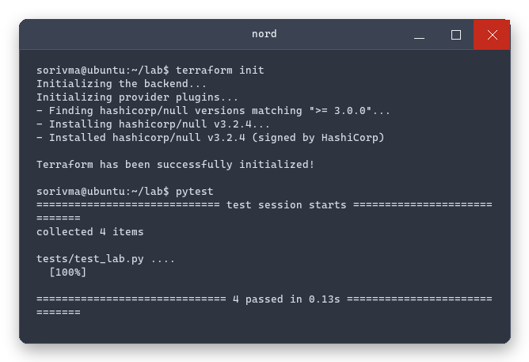 |

| Solarized Dark | Solarized Light | Monokai |
| --- | --- | --- |
| 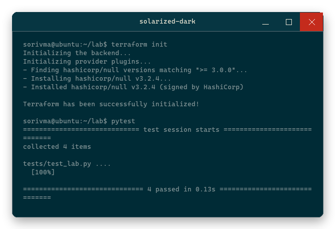 |  |  |

| One Dark | Catppuccin Mocha | Catppuccin Latte |
| --- | --- | --- |
| 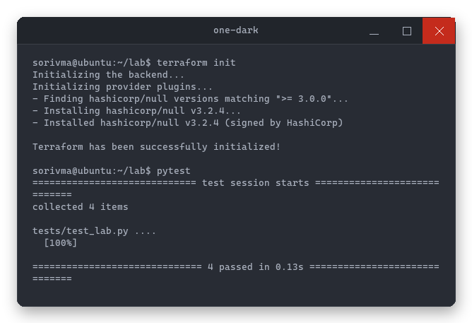 |  | 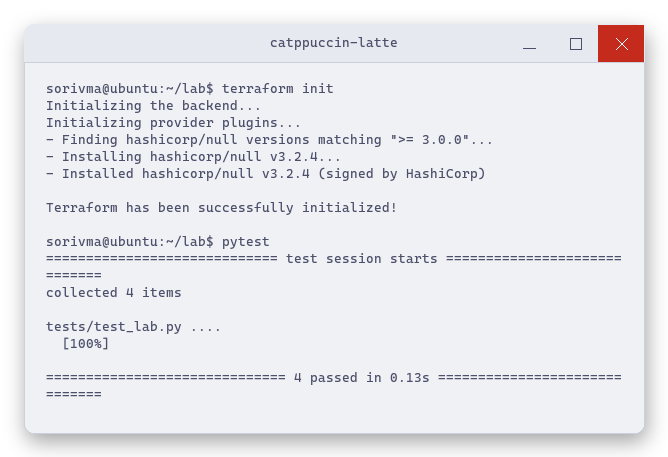 |

| Tokyo Night | Rose Pine | GitHub Dark |
| --- | --- | --- |
| 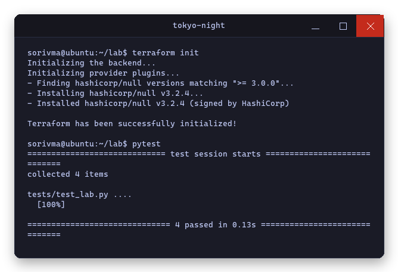 |  | 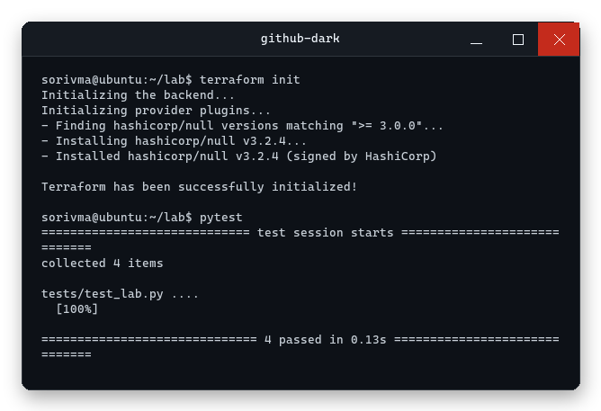 |

| GitHub Light |
| --- |
| 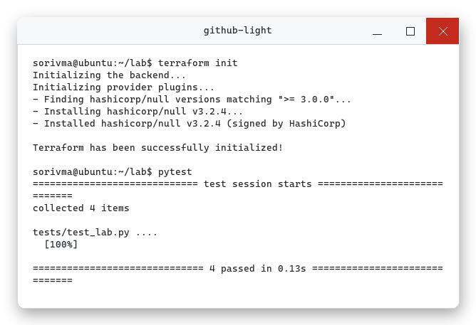 |

Syntax theme presets:

| VS Code Dark | VS Code Light | IntelliJ Dark |
| --- | --- | --- |
|  |  |  |

| IntelliJ Light | Dracula | Gruvbox Dark |
| --- | --- | --- |
| 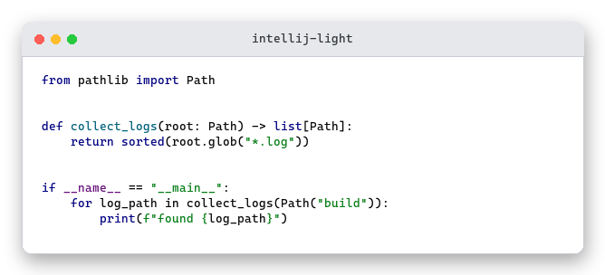 | 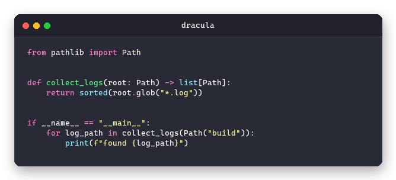 | 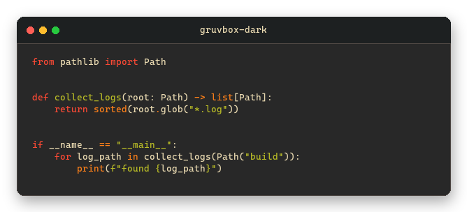 |

| Gruvbox Light | Nord | Solarized Dark |
| --- | --- | --- |
| 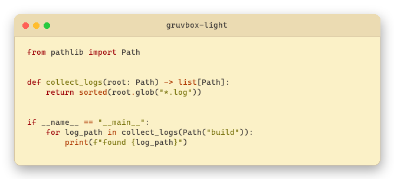 | 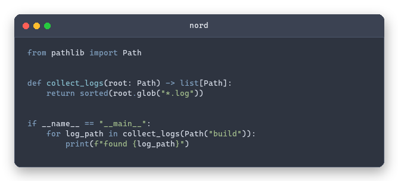 | 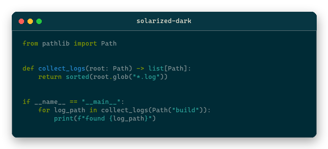 |

| Solarized Light | Monokai | One Dark |
| --- | --- | --- |
| 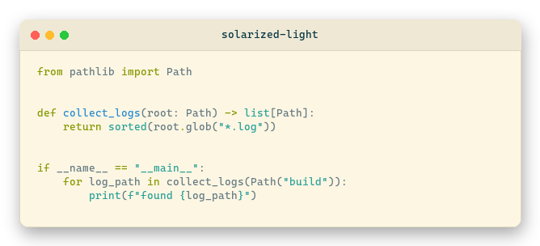 | 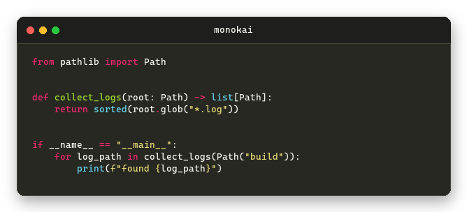 | 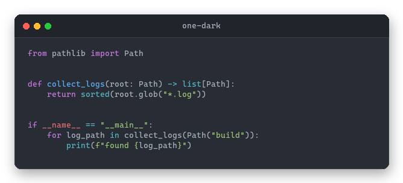 |

| Catppuccin Mocha | Catppuccin Latte | Tokyo Night |
| --- | --- | --- |
| 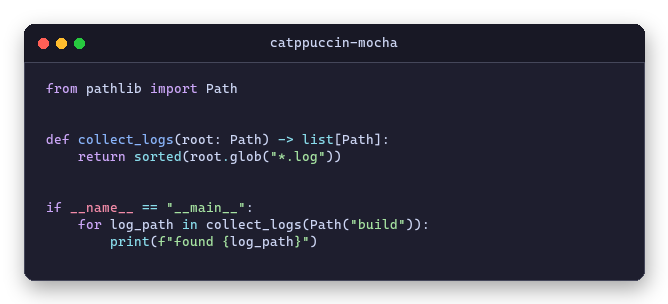 | 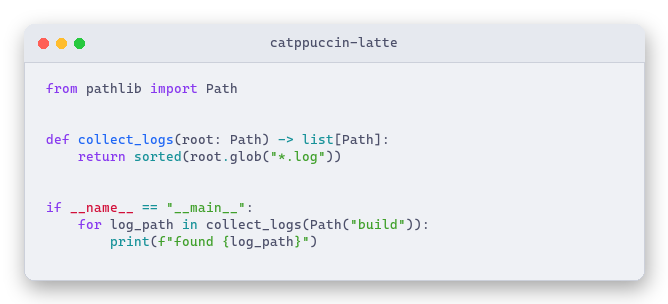 | 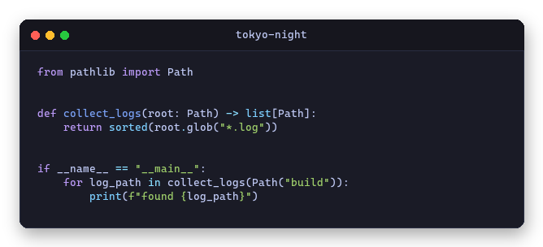 |

| Rose Pine | GitHub Dark | GitHub Light |
| --- | --- | --- |
| 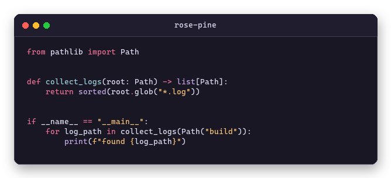 | 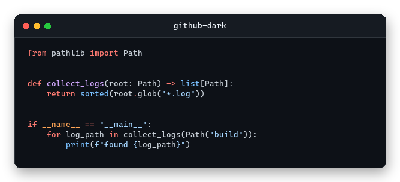 | 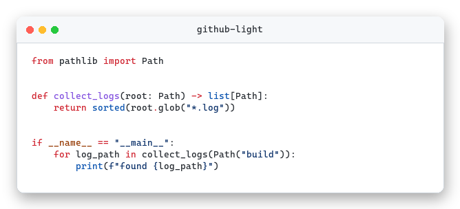 |

## Custom Themes

Custom theme files use the same JSON shape as the built-in theme resource. They are merged with built-in themes, so a file can add only the themes it needs:

```json
{
  "terminal_themes": {
    "lab": {
      "background": "#101820",
      "titlebar": "#1b2a33",
      "title_text": "#f7f7f7",
      "text": "#f2aa4c",
      "muted": "#99aabb",
      "border": "#334455",
      "shadow": "#000000"
    }
  },
  "syntax_themes": {
    "lab-code": {
      "background": "#101820",
      "text": "#f7f7f7",
      "colors": [
        {"token": "Keyword", "color": "#f2aa4c", "bold": true},
        {"token": "String", "color": "#99ddff"}
      ]
    }
  }
}
```

Use it from the CLI:

```powershell
console-gen themes --theme-file themes.json
console-gen render -i lab.log -o build/lab.png --theme-file themes.json --theme lab
console-gen render -i app.py -o build/app.png --content-type code --theme-file themes.json --theme lab --syntax-theme lab-code
```

The same `theme_file`, `theme`, and `syntax_theme` keys can be placed in a render config. Relative `theme_file` paths are resolved from the config file directory.

## Saving ANSI Logs

Many CLI tools disable colors when output is redirected to a file. Force colors and save with `tee` or `Tee-Object`.

Linux/macOS:

```bash
pytest --color=yes | tee lab.log
ansible-playbook site.yml --force-color | tee lab.log
docker compose logs --ansi always | tee lab.log
```

PowerShell:

```powershell
pytest --color=yes 2>&1 | Tee-Object lab.log
$env:FORCE_COLOR = "1"
some-command 2>&1 | Tee-Object lab.log
```

Check that ANSI codes were saved:

```powershell
python -c "print(repr(open('lab.log', encoding='utf-8').read()[:300]))"
```

Look for sequences such as `\x1b[32m` and `\x1b[0m`.

## Development

```powershell
pytest
```
